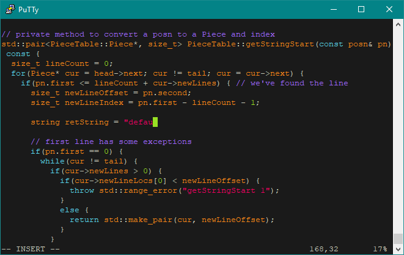
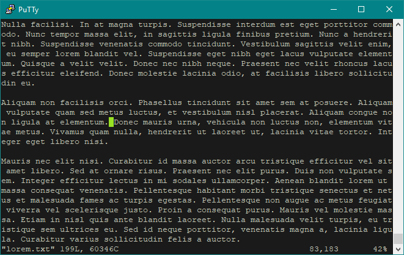
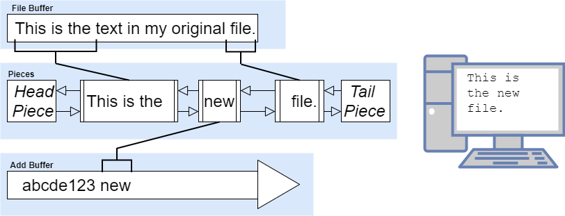
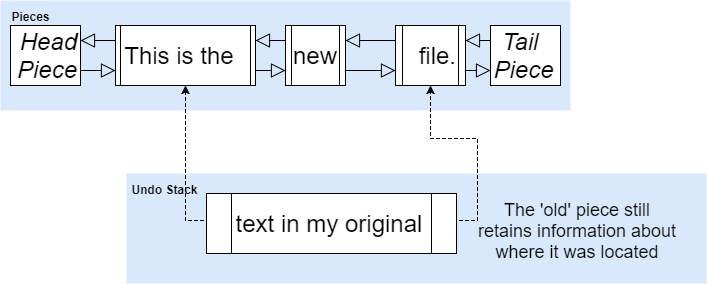

# vimim

**Vim IMitation** ~ A Vim-like text editor made in C++ (using ncurses)

Created by : Julien He & Kevin Sangbeom Park (Dec 2017)

----------
_**NOTE** : This project was a final assignment for my (Advanced) Object-Oriented Programming course, and as such, the source code is [only available upon request](mailto:hejulien22@gmail.com?Subject=vimim%20Source%20Code%20Request)._

_I have still included the Linux executable which can be run with :_ `./vimim <filename(s)...>`

----------

## About
The goal of this project was to create a Vim-like text editor with robust, maintainable code that follows the MVC design pattern. The program aimed to follow good OOP design principles such as the SOLID principles and low-coupling/high cohesion. One of the main focuses of the project was to maintain high resilience to change (open/closed principle), and the various design decisions reflect such ideals.

## Features
Vimim is not a complete replica of Vim, but it's pretty close in most of the main commands. 

Here's what is currently implemented :

 - `a` : Append text after the cursor times
 - `A` : append at end of the line (equivalent to `$a`)
- `b` : jump backwards to the start of the word
 - `cc` : change (replace) the entire line and enter insert mode (equivalent to `ddO`)
 - `S` : same as `cc`
 - `c[arrow]` :
	 - `c[left/right]` : copy left/right char and remove it, and enter insert mode
	 - `c[up]` : move cursor up, then `2cc`
	 - `c[down]` : `2cc`
 - `dd` : delete (cut) line
 - `d[arrow]` : same as `c[arrow]` with `dd`, but do NOT enter insert mode
 - `f[char]` : jump to the next char on the current line (everything to the right of cursor)
 - `F[char]` : jump to the prev char on the current line (everything to the left of cursor)
 - `h` : move cursor left
 - `j` : move cursor down
 - `k` : move cursor up
 - `l` : move cursor right
 - `i` : enter insert mode before cursor
 - `I` : enter insert mode at beginning of line (equivalent to `^i`)
 - `n` : repeat last `/` or `?` search 
 - `N` : repeat last `/` or `?` search in the opposite direction
 - `o` : enter newline at end of current line, move cursor down and enter insert mode
 - `O` : enter newline at beginning of current line, cursor goes to before the newline char and enter insert mode
 - `p` : paste clipboard after the cursor
 - `P` : paste clipboard before the cursor
 - `r[char]` : replace char at cursor with char
 - `R` : enter Replace mode
 - `s` : delete character and enter insert mode (equivalent to `c[right]`)
 - `u` : undo last command (note: not all commands are undoable, e.g. `hjkl`/other movement commands)
 - `ctrl-r` : redo
 - `w` : jump forward to start of next word (considers lines and punctuation :note based off of groups : alphanumeric + _, punctuation)
 - `x` : delete (cut) character (equivalent to delete button)
 - `X` : delete (cut) character before cursor
 - `yy` : yank (copy) a line 
 - `y[arrow]` : same as `d[arrow]` but copy instead of cut
 - `J` : join next line to the current line with a space in between (replace next newline with a space) (equivalent to `$[del]a[space]` )
 - `^` : jump to first non empty character of the line
 - `$` : jump to end of the line
 - `0` : jump to start of line (including empty chars)
 - `;` : repeats the last `f` or `F` command
 - `/[pattern]` : search forwards for next occurrence of `pattern`
 - `?[pattern]` : search backwards for next occurrence of `pattern`
 - `%` : If currently at one of `{`,`(`,`[` , jump to its corresponding closing bracket. Otherwise, find the next bracket on the current line and jump to its partner bracket.
 - `ctrl-b` : move back one screen (page-up)
 - `ctrl-f` : move forward one screen (page-down)
 - `ctrl-d` : move forward 1/2 screen
 - `ctrl-u` : move back 1/2 screen
 - `ctrl-g` : print at bottom current file name and path, file status,  cursor position.
 
 - `:w [filename]` : save file [optional filename for save as]
 - `:q` : quit file as long as not modified, fails when changes have been made
 - `:wq [filename]` : save and quit [optional filename for save as and quit]
 - `:q!` : exit without saving 
 - `:r [file=current file]` : copies file and pastes it below the current cursor
 - `:[num]` : jump to num line of file
 - `:0` : jump to beginning of file
 - `:$` : jump to end of file
 - `<esc>` : cancel the current command

Additionally, there is also :

 - Syntax highlighting for C++ files (needs to end in `.cc` or `.h`)
 - Support for multiple files
	 - Still kind of rough at the moment. Can open multiple files with `./vimim <file1> <file2> ...`, and then switch in between the different files with `:next` and `:prev`
 - Numeric Multipliers: Almost all of these commands support multipliers, as in you can add a number before to repeat the value multiple times. 
	 - For example: `3d4/abc` will find the 4th instance of `abc` after the cursor and delete everything from the cursor to `abc`, then repeat all of that again 2 more times (3 times total). Why you would ever use such a command is beyond me, but it's there if you ever need it ;)

Future Things to Implement:

 - Macros (the `q` and `@` commands)
 - The `.` command
 - Regex pattern searching
 - Split screen (for multiple files)

## How it works
The main 'piece' of vimim is a ***piece table*** that is used as the primary data structure. Piece tables are really useful data structures for text editors as they allow for more efficiency when dealing with large files, provide easy implementations for infinite undoes and redoes, and have efficient space usage (for more info on piece tables and their effectiveness, see [Charles Crowley's paper](http://www.cs.unm.edu/~crowley/papers/sds.pdf) on the subject).

There are various ways that piece tables can be implemented, but the way I chose to implement it was through a **piece chain / doubly-linked list**.

First, we start off by initializing **two buffers**:
 
 - One is the *file buffer* - this holds the original file text and is read-only
 - The second is the *add buffer* - this is where any new text additions go. This buffer is append-only
 - The essential thing to realize here is that text is never deleted (it is a *persistent data structure*), and as such, this allows for efficient and infinite undoes/redoes

We also initialize two null nodes / pieces which are the head and tail of our piece table, plus a piece for the entire text. Each piece keeps track of its *previous and next piece*, as well as a *buffer*, *start index*, and *length*. The pointers to the other pieces are for the doubly-linked list, and the buffer/indices data is so that we know what text is associated with the piece. By using such indices, we have no need to copy text to each piece; any text we need is always in a buffer, and we can simply access it through pointers. 

Whenever we add more text to the file, we append this text to the end of the add buffer, and create a new piece at the location of the insert, with pointers to the text in the add buffer. 

Of course there are plenty of edge cases, but in general whenever we *insert*, we split a piece into two smaller pieces, add text to the add buffer, and insert a new piece with that text in between the two small pieces.

For *deleting*, we simply need to replace pieces with modified ones that point to slightly different locations in the buffer (depending on how much was deleted).

*Replacing* is essentially just deleting and inserting at the same time.

For *undoing and redoing*, the implementation is actually quite simple with a piece table. When we remove a piece, we simply detach it by changing the pointers that point to that piece. We then add the deleted piece to the undo stack. HOWEVER, this deleted piece still points to its old previous and next piece. So when we want to revert this change, we simply need to pop the piece off the stack and follow its pointers to reattach it to the list. Similarly, we would then push whatever just got removed and put it onto the redo stack.

This results in extremely efficient undoes/redoes in terms of space and time, as we do not need to store deleted text, only their locations in the buffers. 

An additional element that I added for efficiency purposes, is that each piece also *caches the number and locations of all the newlines* within its text. This is because it is often necessary to access lines instead of pieces, so this caching saves a lot of additional calculations. 
